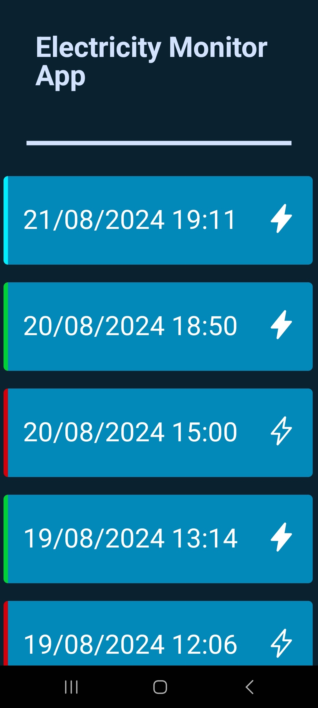

# Electricity Monitor

### Who it is for

If you come from a country with questionable electricity reliability, and you would like to go out knowing your fridge/freezer hasn't been compromised, this is for you.

### Requirements

* A phone to see the power history
* A remote server - Will act as the monitor and assuming it is unimpeded by electricity cuts
* Any device at home (no worries if it turns off in power cuts)
* A 24/7 internet connection which turns off in a powercut
* A Firebase realtime database (free!)

### Setting up Firebase server
* Create a project [here](https://console.firebase.google.com/)
* Click on `Realtime Database`
* Under the URL, add a [generated UUID4](https://andrewbuhagiar.com:8443/uuid4) as an empty/random dictionary (the monitor will take care of the rest)

### Setting up devices
* Download the apk on your phone from the GitHub published packages or build it yourself by referring [here](./frontend/README.md)
* On the remote server, go to the `monitor` directory and run `docker compose up -d --build`
* On the device at home, go to the `reporter` directory and run `docker compose up -d --build`