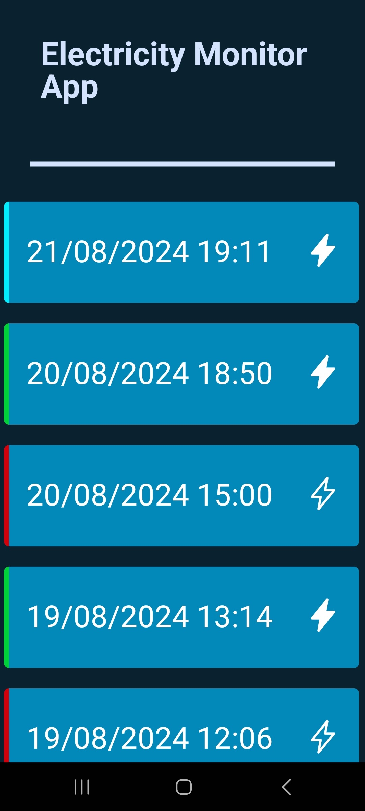

# Electricity Monitor

### Who it is for

If you come from a country with questionable electricity reliability, and you would like to go out knowing your fridge/freezer hasn't been compromised, this is for you.

### Requirements

* A phone to see the power history
* Any device at home (must turn off in power cut and power back up when power comes back)
* A 24/7 internet connection (but can cut during powercut)
* A Firebase realtime database (free!)

### Setting up Firebase server
* Create a project [here](https://console.firebase.google.com/)
* Click on `Realtime Database`
* Under the URL, add a [generated UUID4](https://andrewbuhagiar.com:8443/uuid4) as an empty/random dictionary (the monitor will take care of the rest)

### Setting up devices
* Build the apk by referring [here](./frontend/README.md) after setting the [Firebase config](./frontend/app/(tabs)/firebaseConfig.js)
* On the device at home, go to the `reporter` directory and run `docker compose up -d --build`